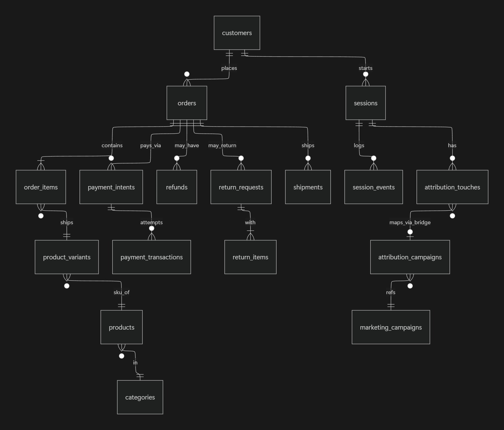

## A. Table Inventory

| Table Name | Approx Row Count | What it Stores | Grain |
|---|---|---|---|
| addresses | 16,000 | Stores address details | One row per `address_id` |
| attribution_campaigns | 38,405 | Stores cost per touch | One row per touch id |
| attribution_touches | 100,000 | Stores touch details | One row per touch id |
| brands | 120 | Stores brand names | One row per brand |
| categories | 18 | Stores category names | One row per category |
| collection_products | 0 | Blank table | - |
| collections | 0 | Blank table | - |
| consents | 0 | Blank table | - |
| coupons | 50 | Stores coupon details | One row per coupon |
| customer_addresses | 16,000 | Stores address type (shipping/billing) | One row per address id |
| customer_segments | 10 | Stores customer segment names | One row per segment |
| customers | 10,000 | Stores customer details | One row per customer |
| devices | 85,168 | Stores device details (type, model, OS) | One row per device |
| experiment_assignments | 140,670 | Stores details about the date of experiments | Multiple rows per experiment |
| experiment_variants | 12 | Stores details about different variants of experiment | Multiple rows per experiment |
| experiments | 6 | Stores details about experiment and hypothesis | One row per experiment |
| inventory_items | 2,000 | Stores details about inventory on hand and reserved | One row per variant |
| inventory_movements | 30,207 | Stores details about inventory movement | One row per event |
| loyalty_accounts | 3,000 | Details about customer loyalty tier (bronze, silver, gold) | One row per customer |
| loyalty_transactions | 21,475 | Stores loyalty reasons and points for each customer | One row per transaction |
| marketing_campaigns | 100 | Stores details about campaigns | One row per campaign |
| notifications | 6,856 | Details about how customer was notified (SMS, email) | Multiple rows per customer |
| order_items | 81,806 | Stores line item details per order | Multiple rows per order |
| order_status_history | 158,414 | Details about order status | Multiple rows per order |
| orders | 40,000 | Stores details about each order | One row per order |
| payment_intents | 40,000 | Details about payment status and method used | One row per order |
| payment_methods | 5 | Payment method names | One row per method |
| payment_transactions | 40,034 | Stores payment gateway and status details | One row per transaction |
| price_lists | 2 | Stores currency details | One row per currency |
| prices | 24,180 | Stores price details for variants in INR and USD | Two rows per variant |
| product_images | 7,188 | Stores image links for each product | Multiple rows per product |
| product_reviews | 8,000 | Stores reviews about each product | Multiple rows per product, customer, and order |
| product_variants | 12,090 | Stores details about each SKU | One row per SKU |
| products | 4,000 | Stores product details | One row per product |
| promotion_rules | 30 | Stores promo rules and maps to product and category | One row per product and category |
| promotions | 20 | Stores details about promo and discount value | One row per promo |
| refunds | 260 | Stores details about order refunds | One row per order |
| return_items | 2,004 | Stores return item details | Multiple rows per variant |
| return_reasons | 8 | Details about return reasons | One row per reason |
| return_requests | 1,603 | Stores details about return requests | One row per order |
| segment_memberships | 16,461 | Stores customer's membership validity | Multiple rows per customer |
| session_events | 292,903 | Stores session event details (product view, add to cart, etc.) | Multiple rows per customer |
| sessions | 100,000 | Stores details about the session (duration, device, customer, etc.) | Multiple rows per customer |
| shipments | 32,089 | Stores details about shipment carrier, shipping and delivery date | One row per order |
| shipping_carriers | 3 | Details about shipment carriers | One row per carrier |
| shipping_methods | 3 | Details about shipment method and prices | One row per method |

## B. Per-Column Notes

| Table Name | IDs | Joins to | Timestamps |
|---|---|---|---|
| orders | Identifies orders | Joins to `customers`, `sessions`, `price_lists`, `customer_addresses`, `coupons`, `order_items` | When order was created |
| order_items | Identifies order line items | Joins to `product_variants` | - |
| customers | Identifies details about each customer | Joins to `orders`, `sessions`, `loyalty_accounts`, `segment_memberships` | When customer account was created |
| sessions | Identifies details about customer sessions | Joins to `customers`, `devices` | When the session started and ended |
| attribution_touches | Identifies how the customer is coming to the platform | Joins to `attribution_campaigns`, `sessions` | When the attribution touch occurred |
| payment_intents | Identifies the amount and status of payment | Joins to `orders`, `payment_methods` | When the payment intent was generated |

## C. ER Diagram

## D. Five Things That Surprised Me

- **`customers.source` and `customers.utm_source` are duplicate columns** — both hold the same value. Worth deciding which one is canonical before using either in a query, and documenting that choice so future queries don't accidentally join or filter on the "wrong" one.
- **`orders.status` string formatting is inconsistent** — values aren't cleanly cased/formatted. Normalize (e.g. `lower(status)`) before grouping or filtering, or you'll silently split what should be one bucket into several.
- **Cancelled orders have `payment_status = 'failed'`** — a cancelled order isn't just a fulfillment-state thing; it also shows up as a failed payment. Any query counting "failed payments" needs to decide whether cancelled-order failures should be included or excluded, since conflating the two overstates genuine payment failures.
- **`orders.total` ≠ `SUM(order_items.line_total)`** — because `orders.total = subtotal + tax`, not just the sum of line items. This is exactly the divergence the brief warns about (§7E example) — decide which is "canonical" for revenue
